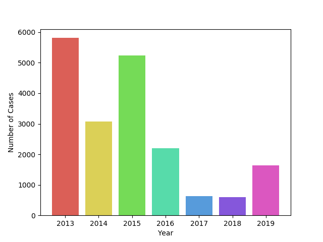
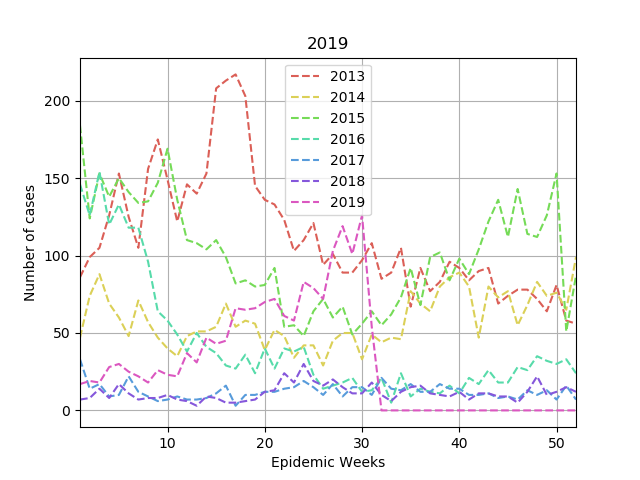

# Dengue Ibague
Dengue Ibague data analysis

## Dengue time evolution

Total cases by year            | Time evolution
:-------------------------:|:-------------------------:
  |  

## Dengue time evolution risk index by Comuna from 2013-2018

2013           | 2014
:-------------------------:|:-------------------------:
  |  

2015           | 2016
:-------------------------:|:-------------------------:
  |  

2017           | 2018
:-------------------------:|:-------------------------:
  |  

## Dengue time evolution cases by Comuna from 2013-2018

2013           | 2014
:-------------------------:|:-------------------------:
  |  

2015           | 2016
:-------------------------:|:-------------------------:
  |  

2017           | 2018
:-------------------------:|:-------------------------:
  |  

