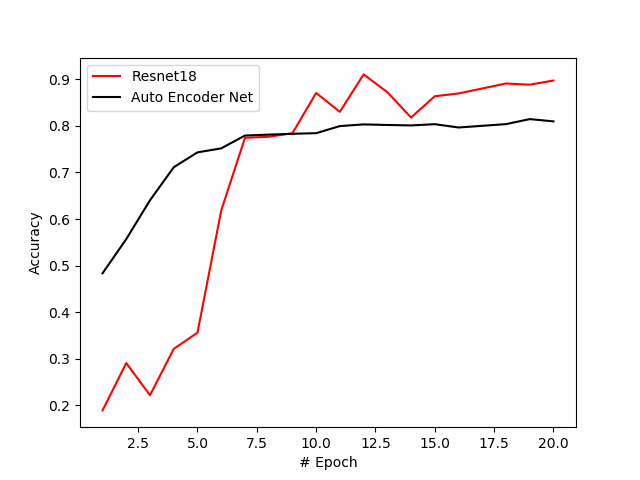

# Homework 02: Unsupervised Learning

## Author: Jaime Enrique Cascante Vega | 201413770

### Goal

- Use the unsupervised method proposed in ___ for the clasiffication problem in MNIST

- Propose a Encoder-Decoder Architecture so MNIST images can be reconstructed

### Results
  The figure below shows the results from adapting the code with the resnet18 architecture compared with a encoder-decoder  with the proposed architecture.

  
  As the loss in both problems is different we use the accuracy that used kNN for measuring the classification. Is impossible to compare the performance of both as the loss for the encoder-decoder consider the reconstruction loss (the loss that captures how good the decoder maps from the latent space to the image-input space. The reconstruct loss just count the pixel-pixel variation in the reconstruction using de L2 norm.
  
   Below is shown the performance (Top 1 Accuracy) obtained by both architectures. As expected resnet18 clasify way better than the encoder-decoder with the enconder suggested architecture, this is probably caused by the incapacity of the encoder to represent deeply all the features of the images (just 1 layer). 
  
  

  

